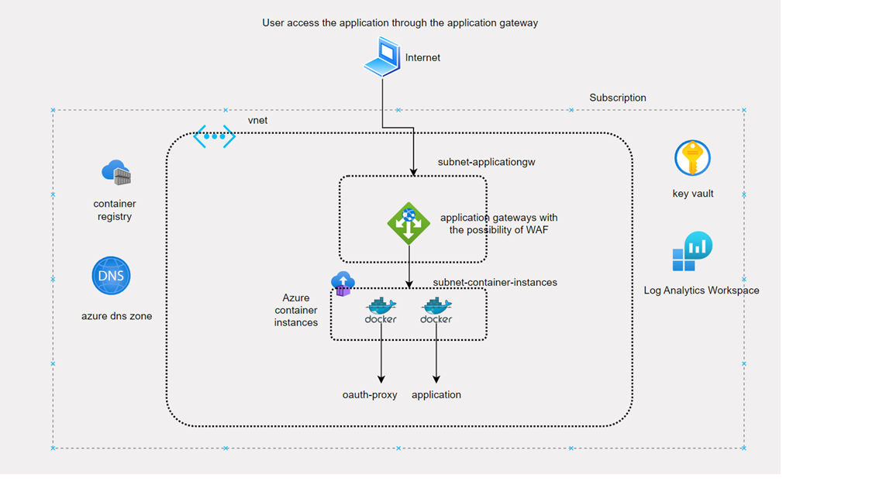

# Architecture

The goal here is to develop azure infra using bicep for hosting a web application using azure container instances. The architecture is below 

  
   

#### Infrastructure as code

* The infra is written in bicep and deployed to Azure using Azure devops pipeline. Azure stack is used to segregate into sub-deployments
* The oauth-proxy is used as one of the container along with the app container and it is the oauth proxy which introspects the token and then forwards the request to the app. The app is not exposed. It is only reachable from the container group.
* The TLS is terminated in the application gateway. The application gateway has integration with the Keyvault. The certificate is stored in the keyvault and whenever a new version of the certificate is put in the keyvault the application gateway will replace the certificate
* The certificates are obtained from LetsEncrypt. Since the certificates from LetsEncrypt expires every 90 days a cron job is created. The cronjob is in function app and run every month to get a new certificate. 